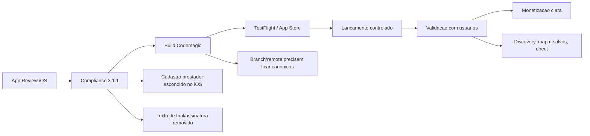

# Flow App Dashboard

## Leitura Rapida

O Flow App esta em fase de revisao de loja e consolidacao de produto.

Estado de agora:

- app Flutter existe e compila
- experiencia visual premium esta forte
- Apple App Review apontou risco em cadastro de prestador/negocio
- iOS foi ajustado para esconder criacao/ativacao profissional
- commit de compliance existe: `68bfe89 Prepare iOS review compliance build`
- branch enviada ao GitHub: `ios-review-compliance-flow`
- Codemagic ainda depende de alinhar a branch monitorada

## Mapa Visual

Abrir no Obsidian:

- [[01 - Progress Map]]
- [[02 - Roadmap Longo Prazo]]
- [[03 - Log de Progresso]]
- [[04 - Ritual de Atualizacao]]

## Grafico de Progresso

## Score Atual

| Area | Status | Progresso | Proxima acao |
|---|---|---:|---|
| App Review iOS | Em revisao | 70% | Confirmar build correta no Codemagic |
| Compliance Apple | Em andamento | 75% | Revisar rotas e screenshots antes de reenviar |
| UX premium | Forte | 80% | Padronizar copy, contraste e estados vazios |
| Discovery social | Em construcao | 65% | Quebrar componentes e validar sinais reais |
| Codemagic/Git | Instavel | 45% | Definir repo/branch canonicos |
| Monetizacao | Indefinida | 25% | Escolher: iOS cliente-only, web provider, ou IAP |
| Obsidian/Memory | Reorganizando | 55% | Manter este dashboard atualizado a cada sessao |

## Prioridade Agora

1. Garantir que o Codemagic gere uma build a partir da branch correta.
2. Reenviar build iOS sem cadastro profissional e sem linguagem de trial externo.
3. Atualizar screenshots/metadados para nao mostrar tela antiga de barbearia/trial.
4. Criar decisao formal sobre prestador no iOS: esconder, companion, ou IAP.
5. Transformar o visual premium em sistema consistente.

## Links Canonicos

- [[../00 - Hub]]
- [[../10 - Estado Atual]]
- [[../11 - Proxima Acao]]
- [[../13 - Fonte de Verdade]]
- [[../AI Memory/00 - AI Memory Hub]]
