# Progress Map

## Visao

Este mapa existe para acompanhar o progresso do app em blocos visuais.

Regra de uso:

- atualizar ao final de cada sessao de trabalho
- mover progresso em porcentagem apenas quando houver evidencia
- registrar commits, builds e decisoes no [[03 - Log de Progresso]]
- manter o grafico simples o bastante para bater o olho e entender

## Painel Visual

```mermaid
flowchart TB
  S[Flow App]:::core

  S --> R[Revisao Apple]:::warn
  S --> U[UX e Produto]:::good
  S --> T[Tecnico]:::warn
  S --> G[Crescimento]:::cold
  S --> M[Monetizacao]:::risk

  R --> R1[3.1.1 Payments: cadastro provider escondido no iOS]:::done
  R --> R2[Screenshots/metadados sem tela antiga]:::todo
  R --> R3[Resposta App Review preparada]:::done

  U --> U1[Hero e descoberta premium]:::done
  U --> U2[Grid, copy e contraste consistentes]:::doing
  U --> U3[Estados vazios e onboarding cliente]:::todo

  T --> T1[Git remoto canonico]:::doing
  T --> T2[Codemagic branch correta]:::todo
  T --> T3[Quebrar discovery_hub_page]:::todo
  T --> T4[Testes de rotas iOS]:::todo

  G --> G1[Metricas de descoberta]:::todo
  G --> G2[Funil cliente: buscar, salvar, conversar]:::todo
  G --> G3[Prestador via web ou IAP]:::todo

  M --> M1[Decisao Apple-safe]:::todo
  M --> M2[Provider web/IAP/companion]:::todo

  classDef core fill:#d7b75b,stroke:#111,color:#111;
  classDef done fill:#274f3b,stroke:#d7b75b,color:#fff;
  classDef doing fill:#5c4a24,stroke:#d7b75b,color:#fff;
  classDef todo fill:#1d2027,stroke:#555,color:#ddd;
  classDef warn fill:#2b2530,stroke:#d7b75b,color:#fff;
  classDef risk fill:#442626,stroke:#d7b75b,color:#fff;
  classDef good fill:#202f25,stroke:#d7b75b,color:#fff;
  classDef cold fill:#202833,stroke:#d7b75b,color:#fff;
```

## Progresso por Pilar

| Pilar | Progresso | Situacao |
|---|---:|---|
| App Review iOS | 70% | Corrigido no codigo, falta garantir build/reenvio |
| UX premium | 80% | Forte, precisa consistencia fina |
| Plataforma tecnica | 55% | Funciona, precisa repo/CI/testes e modularizacao |
| Discovery social | 65% | Base boa, precisa medir sinais reais |
| Monetizacao | 25% | Decisao estrategica pendente |
| Operacao comercial | 20% | Ainda sem usuarios reais e funil validado |

## Semaforo Atual

- Verde: visual premium, discovery, mapa, estrutura Flutter, Firebase base
- Amarelo: App Review, Git/Codemagic, copy sensivel, screenshots
- Vermelho: modelo de monetizacao iOS ainda nao decidido

## Atualizacao Rapida

Quando uma tarefa andar, atualizar:

- porcentagem do pilar
- status do node no Mermaid: `todo`, `doing` ou `done`
- entrada no [[03 - Log de Progresso]]
- se for decisao permanente, registrar tambem em [[../12 - Decisoes Irrevogaveis]]
